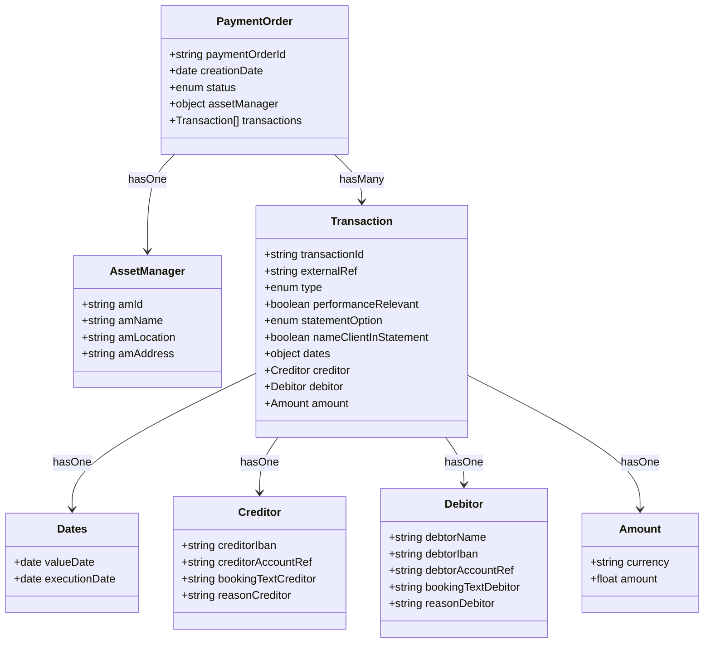

**Entity Relationships of a Payment Order (color-coded)**

_🟢 Green = SFTI-compatible entity (all fields)_  
_🔴 Red = Not part of current SFTI CA Payment API (or mostly incompatible)_

---

### 🛑 Out-of-Scope Fields

| Field                  | Reason for Exclusion                                                                 |
|------------------------|--------------------------------------------------------------------------------------|
| `creditorIbanCurrency` | The target account's currency is determined by the IBAN itself; value is redundant.  |
