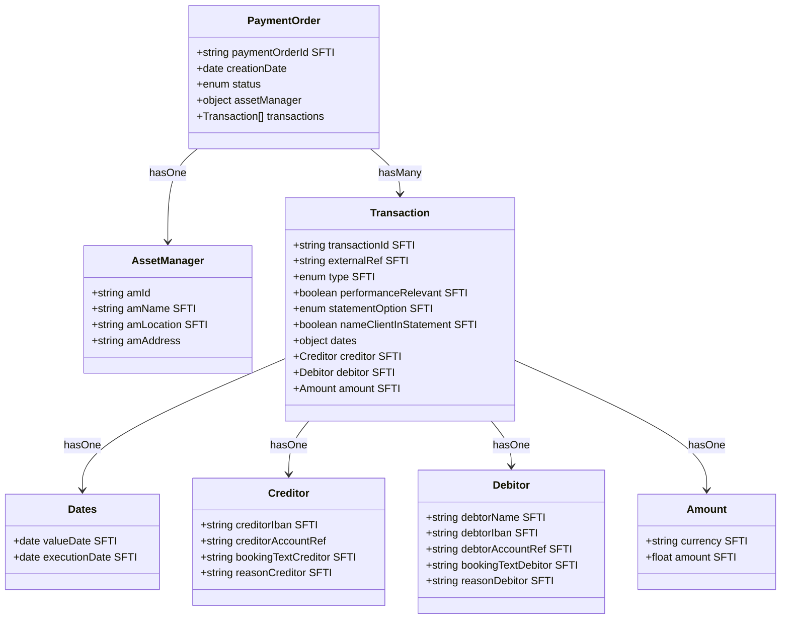

**Entity Relationships of a Payment Order**

_Third column "SFTI" = field is part of SFTI CA Payment API_

---

### 🛑 Out-of-Scope Fields

| Field                  | Reason for Exclusion                                                                 |
|------------------------|--------------------------------------------------------------------------------------|
| `creditorIbanCurrency` | The target account's currency is determined by the IBAN itself; value is redundant.  |
