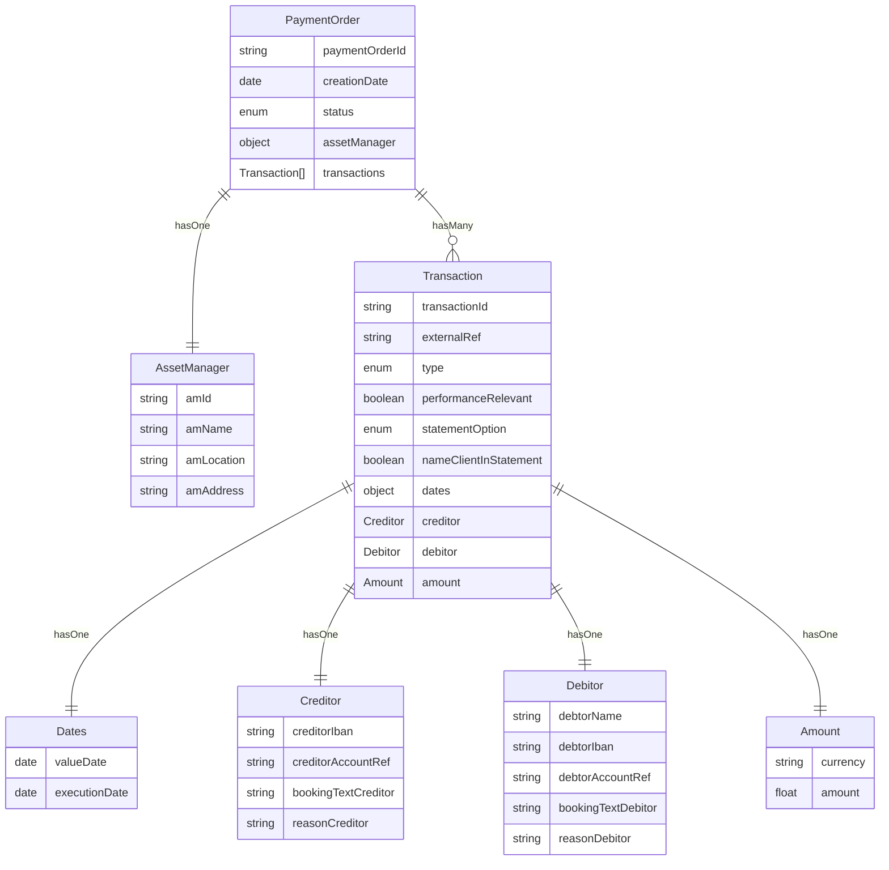

**Entity Relationships of a Payment Order**

---

### ✅ SFTI Compatibility Table

| Entity        | Field                   | SFTI | SFTI Field Name         | SFTI Path                                      |
|---------------|--------------------------|------|
| PaymentOrder  | paymentOrderId           | YES  | -                         | -  |
| PaymentOrder  | creationDate             | NO   |
| PaymentOrder  | status                   | NO   |
| PaymentOrder  | assetManager             | NO   |
| PaymentOrder  | transactions             | NO   |
| AssetManager  | amId                     | NO   |
| AssetManager  | amName                   | YES  | institutionName           | transaction > creditor > institutionName  |
| AssetManager  | amLocation               | YES  | institutionLocation       | transaction > creditor > institutionLocation  |
| AssetManager  | amAddress                | NO   |
| Transaction   | transactionId            | YES  | externalReferenceNumber   | transaction > details > externalReferenceNumber  |
| Transaction   | externalRef              | YES  | externalReferenceNumber   | transaction > details > externalReferenceNumber  |
| Transaction   | type                     | YES  | transactionType           | transaction > details > transactionType  |
| Transaction   | performanceRelevant      | YES  | performanceRelevance      | transaction > details > performanceRelevance  |
| Transaction   | statementOption          | YES  | statementOption           | transaction > details > statementOption  |
| Transaction   | nameClientInStatement    | YES  | namingClient              | transaction > details > namingClient  |
| Transaction   | dates                    | NO   |
| Transaction   | creditor                 | YES  |
| Transaction   | debitor                  | YES  |
| Transaction   | amount                   | YES  |
| Dates         | valueDate                | YES  | valueDate                 | transaction > details > valueDate  |
| Dates         | executionDate            | YES  | executionDate             | transaction > details > executionDate  |
| Creditor      | creditorIban             | YES  | creditorIban              | transaction > creditor > creditorIban  |
| Creditor      | creditorAccountRef       | NO   |
| Creditor      | bookingTextCreditor      | YES  | bookingTextCreditor       | transaction > details > bookingTextCreditor  |
| Creditor      | reasonCreditor           | YES  | transactionReasonCreditor | transaction > details > transactionReasonCreditor  |
| Debitor       | debtorName               | YES  | debitorName               | transaction > debitor > debitorName  |
| Debitor       | debtorIban               | YES  | debitorIban               | transaction > debitor > debitorIban  |
| Debitor       | debtorAccountRef         | YES  | debitorAccount            | transaction > debitor > debitorAccount  |
| Debitor       | bookingTextDebitor       | YES  | bookingTextDebitor        | transaction > details > bookingTextDebitor  |
| Debitor       | reasonDebitor            | YES  | transactionReasonDebitor  | transaction > details > transactionReasonDebitor  |
| Amount        | currency                 | YES  | currency                  | transaction > details > currency  |
| Amount        | amount                   | YES  | currencyAmount            | transaction > details > currencyAmount  |

---

### 🛑 Out-of-Scope Fields

| Field                  | Reason for Exclusion                                                                 |
|------------------------|--------------------------------------------------------------------------------------|
| `creditorIbanCurrency` | The target account's currency is determined by the IBAN itself; value is redundant.  |
